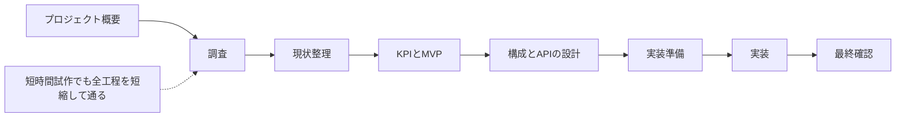

# HVE アプリ開発スターター

GitHub Copilot と Visual Studio Code を使って、調査からアプリの実装と確認まで進めるためのテンプレートです。この進め方を **Hyper Velocity Engineering (HVE)** と呼びます。AIを使って作業を速めながら、判断の根拠、要件とのつながり、テスト結果、人による確認を残します。

テンプレート本体は業務アプリケーション全般に利用できます。工数管理ダッシュボードの記入例も用意しています。

## はじめ方

1. VS Code でこのリポジトリを開きます。
2. Copilot Chat のエージェント選択で `Hyper Velocity Engineering Lead` を選びます。
3. 作りたいものと解決したい課題を入力します。始め方は次の3つのどれでも同じ手順で進みます。
   - **A: そのまま書く（おすすめ）** 例: `短時間試作で進めたい。制限時間は4時間。…`
   - **B: スキルを呼ぶ** `/hve-kickoff` に続けて内容を書きます。
   - **C: プロンプトを使う** 従来どおり `/00-start-project` に続けて内容を書きます。

   進め方の `通常` または `短時間試作` を書かなかった場合は、最初に選択肢が表示されます。
4. エージェントが表示する「次にすること」と「プロンプト候補」を確認します。
5. 人の判断が必要なときは、VS Codeに選択肢が表示されます。回答後は、続けられる作業をエージェントが再開します。
6. 各工程で作った文書を確認し、[プロジェクト進捗](./docs/project-status.md)の確認欄を更新してから次へ進みます。

各エージェントは Claude Opus 5.5 を優先して使います。使えないときは Claude Opus 5、Claude Sonnet 5 の順に切り替わります。モデル選択画面で推論の深さ（Thinking Effort）を選べる場合は、まず `Medium` で試し、結果が足りないときだけ上げてください。

## 短時間で試作する

目的がプロトタイプまたは小さなMVPなら、`Hyper Velocity Engineering Lead` に「短時間試作で進めたい」と書いて依頼します。「制限時間は○時間。利用者が○○できるところまで。成功は△△で確認する。今回は□□を行わない」と入力します。`/hve-kickoff` や `/00-start-project` を使っても同じです。

この進め方でも、開始準備の次に必ず短い調査を行います。市場、代替案、既存事例などから、試作の判断を変える質問を最大2つに絞って調べます。その後は、現状整理、作るものの決定、設計、実装準備、実装、最終確認まで、通常と同じ工程を短縮して進めます。

開始時に確認方法を選びます。`工程ごとに確認` は、各中間工程を軽く確認した後に `入力待ち（HIL）` で停止します。作成物、確認結果、省略した作業、残るリスクを確認し、承認または修正を回答してから次へ進みます。`最後にまとめて確認` は、中間工程を `仮完了` として続け、動作確認後に全工程をまとめて最終確認します。どちらも最終確認は `確認待ち` とし、利用者の確認を待ちます。

どちらを選んでも、広い市場調査や比較を省略した場合は、調べなかった内容、理由、残るリスクを進捗表へ記録します。

短時間試作では、時間を守るために専門エージェントへ任せる作業を、調査、実装、最終確認の3つに絞ります。現状整理、作るものの決定、設計、実装準備の短い文書は `Hyper Velocity Engineering Lead` が自分で作ります。時刻を記録するたびに、進捗表の「経過時間」欄に `経過 X分 / 制限 Y分` を書きます。

### 使用例

`Hyper Velocity Engineering Lead` を選んだ状態で、次の文をそのまま入力します。先頭に `/hve-kickoff` または `/00-start-project` を付けても同じ動きになります。

#### 1. 企画からプロトタイプまで進める

Sample 1: 工数管理ダッシュボード

```text
複数のプロジェクト管理ツールや勤怠システムから出力したデータをまとめ、開発チームの工数を可視化するダッシュボードを作りたい。短時間試作で、市場や既存サービスを調査して可能性を確かめ、要件を決めてプロトタイプまで実装したい。
```

Sample 2: ゲーム形式でプロンプトスキルを学習できるWebサービス

```text
/hve-kickoff ゲーム形式でプロンプトスキルを学習できるWebサービスのビジネスを検討したい。短時間試作で、市場や既存サービスを調査して可能性を確かめ、要件を決めてプロトタイプまで実装したい。
```

#### 2. CSV取込から工数確認まで試作する

```text
進め方は短時間試作。
制限時間は4時間。
プロジェクトマネージャーが工数CSVを取り込み、プロジェクト別・メンバー別の作業時間を週単位で確認できるダッシュボードを作る。
成功は、サンプルCSVを取り込み、集計結果を表とグラフで確認でき、不正な行には直し方が分かるエラーが表示されることで判断する。
今回は認証、勤怠の登録、給与計算、外部システムとの自動連携、本番公開を行わない。
確認方法は、最後にまとめて確認する。
```

次の内容は短時間試作でも自動実行しません。

- 本番への公開
- 実際の機密情報や個人情報の利用
- 法令、安全、権限に関わる重要な判断
- データを消す操作
- 認証情報の入力
- 課金が発生するリソースの作成
- 元に戻しにくい設計変更

## 作業の流れ



短時間試作を選ぶと、下の工程を順番に自動で進めます。個別の工程プロンプトを順番に実行する必要はありません。

| 工程 | 通常で主に作るもの | 短時間試作で行うこと | 通常で使うプロンプト |
| --- | --- | --- | --- |
| 開始準備 | プロジェクト概要、調査したいこと | 主な操作、成功の確認方法、行わないことを決める | 自然文での依頼、`/hve-kickoff`、`/00-start-project` |
| 調査 | 市場、競合、代替案、情報源一覧 | 判断を変える質問を最大2つ調べ、情報源と仮の前提を残す | `/01-research-market` から `/03-research-industry-patterns` |
| 現状整理 | 現在の仕事の流れ、困りごと、KPI | 主な操作に関係する現状と困りごとだけを整理する | `/04-analyze-current-state`、`/05-define-kpis` |
| 作るものの決定 | 要件、MVP、完了条件 | 主な操作を最大3要件にまとめる | `/06-prioritize-mvp` |
| 設計 | データ設計、システム構成、API、利用技術 | 最も簡単で元に戻しやすい設計を選ぶ | `/07-design-data-model` から `/10-select-technology` |
| 実装準備 | 作業順、テスト方針、実装タスク | 1つの実装タスクとテスト方法を決める | `/11-create-delivery-plan`、`/12-break-down-implementation` |
| 実装 | ソースコード、テスト、確認結果 | 主な操作を実装し、自動テストを実行する | `/13-implement-next-task` |
| 最終確認 | 確認レポート | 実行結果、省略した作業、残るリスクをまとめて確認する | `/14-review-phase-gate` |

## 入力待ち（HIL）

HILは、人の入力がないと次へ進めない状態です。入力待ちになると、[プロジェクト進捗](./docs/project-status.md)に次の内容が表示されます。

- 何を決めるか
- 回答の選択肢または入力例
- おすすめと理由
- 回答後に始まる作業
- そのまま使える再開プロンプト

通常はVS Codeの質問画面から回答できます。後から再開するときは、進捗表にある再開プロンプトをCopilot Chatへ入力します。

## フォルダー

- `.github/agents/`: 全体の進行役と専門エージェント
- `.github/prompts/`: 各工程を始めるプロンプト
- `.github/skills/`: 開始、工程の進め方、調査、要件とのつながり、実装、確認の手順（`/hve-kickoff` で開始の手順を呼べます）
- `.github/instructions/`: 文書やコードを書くときのルール
- `docs/templates/`: 文書のひな形
- `docs/project/`: プロジェクト概要と共通の管理表
- `docs/research/`: 市場・競合・業務調査
- `docs/requirements/`: KPI、要件、MVP
- `docs/architecture/`: データ、システム、API設計
- `docs/delivery/`: 計画、タスク、テスト、検証記録
- `docs/examples/`: 記入例
- `src/`: 承認済みタスクから生成するアプリケーションコード
- `tests/`: 要件とタスクに対応する自動テスト

## 大切なルール

- 確認できた事実、そこから考えたこと、仮の前提、提案を分けて書きます。
- 市場調査は一次情報を優先し、URL、公開日または更新日、アクセス日、確度を残します。
- [`INSIGHT`、`KPI`、`REQ`、`ADR`、`TASK`、`TEST`](./docs/README.md#idの意味) のIDを使い、調査結果からテストまでのつながりを残します。
- 工程の完了条件を満たし、利用者が確認するまで次の工程を確定しません。
- 実装は承認済みの `TASK` 単位で行い、対応するテストと検証結果を必須にします。

詳細な成果物の関係は[ドキュメントガイド](./docs/README.md)を参照してください。
