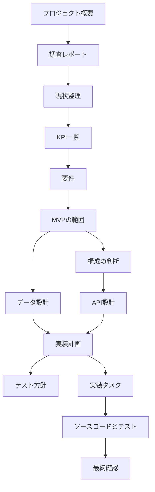

# 文書ガイド

`docs/templates/` には文書のひな形があります。実際のプロジェクトで作った文書は、下の表にあるフォルダーへ保存します。ひな形へ調査結果や判断を書き込まないでください。

## 文書の保存場所

| フォルダー | 保存するもの | 先に確認するもの |
| --- | --- | --- |
| `project/` | プロジェクト概要、情報源一覧、判断記録、リスク一覧、要件とのつながり | 利用者からの情報 |
| `research/` | 市場、代替案、業界の例、現在の仕事の流れ | プロジェクト概要、情報源一覧 |
| `requirements/` | KPI、要件、MVPの範囲 | 確認済みの調査と現状整理 |
| `architecture/` | データ設計、構成の判断、API設計、技術選定 | 確認済みの要件 |
| `delivery/` | 実装計画、テスト方針、実装タスク、確認レポート | 確認済みの設計 |
| `examples/` | 最小限の記入例。実際のプロジェクト文書ではありません | ひな形 |

## 文書を作る順番

## ファイル名

- ファイル名は小文字の英数字とハイフンを使います。
- 順番が大切な文書だけ、`01-market-landscape.md` のように番号を付けます。
- `.github/copilot-instructions.md` で決めたIDを使います。一度付けたIDは変更しません。
- 現在の工程、入力待ち、確認結果は[プロジェクト進捗](./project-status.md)へ記録します。

## 人による確認

必要な項目が埋まり、関連するIDがつながり、重要な未回答事項が解決し、担当者が `project-status.md` に確認結果を書くまでは作業中です。後から新しい情報が見つかった場合は、該当する工程をもう一度確認します。理由は判断記録へ残します。
