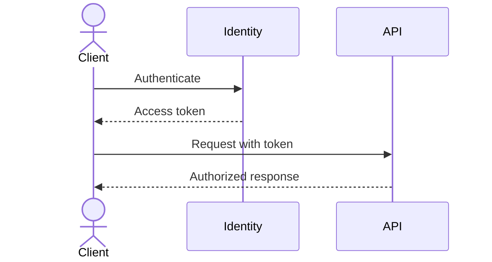

# API設計: `[API名]`

## 目的と利用者

- Related requirements: `REQ-NNN`
- Consumers and use cases:
- Data classification:
- Compatibility commitment:

## 扱うデータ

| Resource | Identifier | Operations | Ownership | Related entities |
| --- | --- | --- | --- | --- |
| | | | | |

## API一覧

| Method | Path | Purpose | Authorization | Idempotent |
| --- | --- | --- | --- | --- |
| GET | `/resources` | | | Yes |

## APIごとの動き

### `GET /resources`

- Requirement: `REQ-NNN`
- Query parameters:
- Request headers:
- Success response and schema:
- Error responses:
- Authorization rule:
- Pagination, filtering, and sorting:
- Rate limit and caching:
- Audit and telemetry:

## 本人確認と利用権限

## エラー時の返し方

| Status | Code | Meaning | Client action | Logged fields |
| --- | --- | --- | --- | --- |
| 400 | | | | |

## 変更時の互換性

- Versioning policy:
- Deprecation policy:
- Schema compatibility:
- Retry and idempotency:

## 完了チェック

- [ ] 各APIが確認済みの要件と利用権限のルールにつながっている。
- [ ] Schemas, errors, pagination, limits, and compatibility are explicit.
- [ ] Sensitive data exposure and audit behavior are reviewed.
- [ ] API behavior can be represented in an executable contract later.

## 次にすること

| おすすめ | 入力する内容 | 回答後に始まる作業 | プロンプト候補 |
| --- | --- | --- | --- |
| API設計を確認する | `[利用者、権限、互換性の確認結果]` | 技術選定または実装準備を始める | `/10-select-technology` または `/11-create-delivery-plan` |

## 人による確認

| 確認する人 | 結果 | 日付 | メモ |
| --- | --- | --- | --- |
| | 確認待ち | | |
