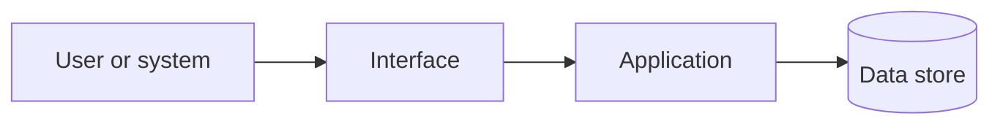

# ADR-NNN: `[決めること]`

## 実行記録

| 処理 | 開始日時 | 終了日時 | 所要時間 | 実行した人またはエージェント |
| --- | --- | --- | --- | --- |
| `[作成、更新、確認など]` | `YYYY-MM-DD HH:mm:ss ±HH:mm` | `YYYY-MM-DD HH:mm:ss ±HH:mm` | `[例: 1時間20分]` | `[名前]` |

## 状態

提案中

## 判断日時と担当

- Decision datetime: `YYYY-MM-DD HH:mm:ss ±HH:mm`
- Decision owners:
- Related requirements: `REQ-NNN`

## なぜ決める必要があるか

課題、制約、必要な品質、仮の前提、判断に影響する条件を書きます。

## 判断で大切にすること

| Driver | Priority | Measurable criterion |
| --- | --- | --- |
| | Must / Should / Could | |

## 選択肢

| Option | Benefits | Costs and limitations | Risks | Driver fit |
| --- | --- | --- | --- | --- |
| A | | | | |
| B | | | | |

## 選んだ案

選んだ案と、大切にする条件に最も合う理由を書きます。

## システム構成

## 選んだ結果

### 良い点

-

### 注意点と受け入れる不便

-

### 後で行うこと

-

## 安全性、運用、費用

- Threats and controls:
- Identity and access:
- Observability and support:
- Availability and recovery:
- Cost model and scaling triggers:

## 確認方法

| Concern | Validation activity | Success criterion | Owner |
| --- | --- | --- | --- |
| | | | |

## 次にすること

| おすすめ | 入力する内容 | 回答後に始まる作業 | プロンプト候補 |
| --- | --- | --- | --- |
| 選んだ案を確認する | `[承認、修正点、または選び直す条件]` | API設計または技術選定を始める | `/09-design-api` または `/10-select-technology` |

## 人による確認

| 確認する人 | 結果 | 確認日時 | メモ |
| --- | --- | --- | --- |
| | 確認待ち | `YYYY-MM-DD HH:mm:ss ±HH:mm` | |
