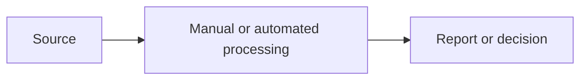

# 現在の仕事の整理: `[仕事または対象領域]`

## 使った情報

- Project brief:
- Interviews and observations:
- Systems and documents reviewed:
- Related insights: `INSIGHT-NNN`

## 要点

現在の結果、特に大きな問題、情報が足りない点を短く書きます。

## 利用者と担当者

| Persona | Jobs to be done | Inputs | Outputs | Pain points | Frequency |
| --- | --- | --- | --- | --- | --- |
| | | | | | |

## 現在の仕事の流れ

| Step | Actor | System | Input | Activity | Output | Time | Failure mode |
| --- | --- | --- | --- | --- | --- | --- | --- |
| 1 | | | | | | | |

## データの流れ

## 現在の数値

| Metric | Current value | Unit | Period | Source | Confidence |
| --- | --- | --- | --- | --- | --- |
| | | | | | |

## 問題と原因

| ID | Observed problem | Evidence | Root-cause hypothesis | Impact | Affected personas |
| --- | --- | --- | --- | --- | --- |
| PROBLEM-001 | | | | | |

## 必要なことと改善の機会

| Persona | Need | Supporting problem or insight | Desired outcome |
| --- | --- | --- | --- |
| | | | |

## 仮の前提と足りない情報

-

## 完了チェック

- [ ] Process and data flows reflect observed or supplied evidence.
- [ ] Baselines include units, periods, and sources.
- [ ] Root-cause hypotheses are labeled and testable.
- [ ] Persona needs connect to identified problems.

## 次にすること

| おすすめ | 入力する内容 | 回答後に始まる作業 | プロンプト候補 |
| --- | --- | --- | --- |
| KPIを決める | `[確認が必要な現在値]` | KPI一覧を作る | `/05-define-kpis` |

## 人による確認

| 確認する人 | 結果 | 日付 | メモ |
| --- | --- | --- | --- |
| | 確認待ち | | |
