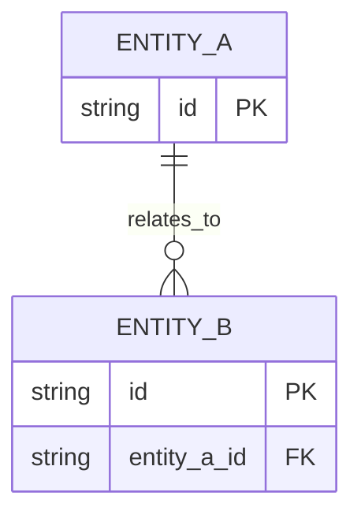

# データ設計

## 実行記録

| 処理 | 開始日時 | 終了日時 | 所要時間 | 実行した人またはエージェント |
| --- | --- | --- | --- | --- |
| `[作成、更新、確認など]` | `YYYY-MM-DD HH:mm:ss ±HH:mm` | `YYYY-MM-DD HH:mm:ss ±HH:mm` | `[例: 1時間20分]` | `[名前]` |

## 前提となる情報

- Related requirements: `REQ-NNN`
- Source systems:
- Expected volume and growth:
- Retention and residency constraints:

## データの全体像

## データの種類

| Entity | Purpose | System of record | Grain | Owner | Classification |
| --- | --- | --- | --- | --- | --- |
| | | | | | Public / Internal / Confidential / Restricted |

## データ項目一覧

| Entity | Attribute | Type | Required | Definition | Validation | Source mapping |
| --- | --- | --- | --- | --- | --- | --- |
| | | | | | | |

## データを正しく保つルール

| Rule ID | Rule | Enforcement point | Failure handling | Related requirements |
| --- | --- | --- | --- | --- |
| DQ-001 | | | | `REQ-NNN` |

## 変更履歴、操作記録、削除

- Change history approach:
- Audit events and actor identity:
- Retention and deletion:
- Backup and recovery objectives:

## 保存方法と速さへの配慮

- Normalization or denormalization decisions:
- Index strategy and expected access patterns:
- Partitioning and archival:
- Concurrency and consistency:
- Estimated capacity and performance:

## データ移行と取り込み

| Source | Mapping | Validation | Idempotency | Rejection and reconciliation |
| --- | --- | --- | --- | --- |
| | | | | |

## 完了チェック

- [ ] Every data requirement maps to an entity, attribute, or rule.
- [ ] Ownership, classification, retention, and deletion are explicit.
- [ ] Access patterns justify indexing and partitioning decisions.
- [ ] Import, quality, history, and recovery behavior are testable.

## 次にすること

| おすすめ | 入力する内容 | 回答後に始まる作業 | プロンプト候補 |
| --- | --- | --- | --- |
| データ設計を確認する | `[不足するデータ、保存期間、機密区分]` | システム構成またはAPIを設計する | `/08-evaluate-architecture` または `/09-design-api` |

## 人による確認

| 確認する人 | 結果 | 確認日時 | メモ |
| --- | --- | --- | --- |
| | 確認待ち | `YYYY-MM-DD HH:mm:ss ±HH:mm` | |
