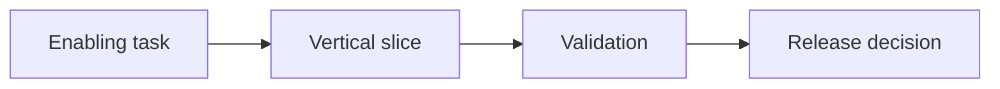

# 実装計画

## 実行記録

| 処理 | 開始日時 | 終了日時 | 所要時間 | 実行した人またはエージェント |
| --- | --- | --- | --- | --- |
| `[作成、更新、確認など]` | `YYYY-MM-DD HH:mm:ss ±HH:mm` | `YYYY-MM-DD HH:mm:ss ±HH:mm` | `[例: 1時間20分]` | `[名前]` |

## 目指す結果

- 確認済みのMVP要件:
- Architecture baseline:
- Target outcome and date:
- Planning assumptions:

## 主な区切り

| 主な区切り | できるようになること | 含む要件 | 開始条件 | 完了条件 | 目標日 |
| --- | --- | --- | --- | --- | --- |
| M1 | | `REQ-NNN` | | | |

## 作業の分け方

| Workstream | Deliverable | Dependencies | Skills or roles | Estimate range | Owner |
| --- | --- | --- | --- | --- | --- |
| | | | | | |

## 作業の順番

## 担当と作業時間

| Role | Responsibility | Capacity assumption | Timing | Gap or action |
| --- | --- | --- | --- | --- |
| | | | | |

## 公開方法と元に戻す方法

- Environments and promotion:
- Data migration or seeding:
- Feature release strategy:
- Rollback conditions and procedure:
- Support ownership:

## リスクと対応

詳しいリスクは `docs/project/risk-register.md` をリンクします。

## 完了チェック

- [ ] Milestones deliver observable outcomes and requirements.
- [ ] Dependencies, estimates, resource assumptions, and risks are visible.
- [ ] Each milestone has entry, exit, validation, and rollback criteria.
- [ ] The first implementation slice can be selected without further decomposition.

## 次にすること

| おすすめ | 入力する内容 | 回答後に始まる作業 | プロンプト候補 |
| --- | --- | --- | --- |
| 実装計画を確認する | `[期限、担当、優先する区切り]` | 実装タスクへ分ける | `/12-break-down-implementation` |

## 人による確認

| 確認する人 | 結果 | 確認日時 | メモ |
| --- | --- | --- | --- |
| | 確認待ち | `YYYY-MM-DD HH:mm:ss ±HH:mm` | |
