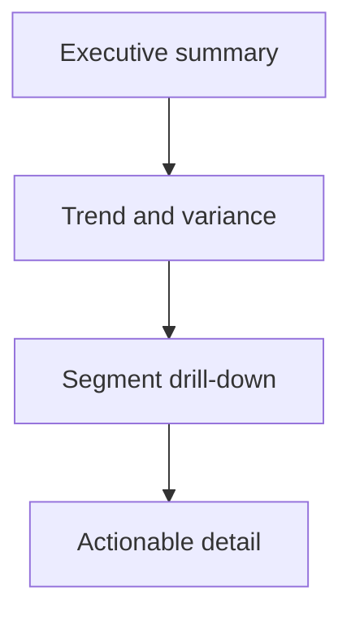

# KPI一覧

## 実行記録

| 処理 | 開始日時 | 終了日時 | 所要時間 | 実行した人またはエージェント |
| --- | --- | --- | --- | --- |
| `[作成、更新、確認など]` | `YYYY-MM-DD HH:mm:ss ±HH:mm` | `YYYY-MM-DD HH:mm:ss ±HH:mm` | `[例: 1時間20分]` | `[名前]` |

## KPIを決めるときのルール

- A KPI must support a stated decision or behavior.
- Define numerator, denominator, scope, exclusions, and time basis.
- Do not use a KPI until its source and data owner are known.

## KPIの定義

| 項目 | 内容 |
| --- | --- |
| ID | `KPI-001` |
| Name | |
| Business question | |
| Decision or action | |
| Definition | |
| Formula | $\text{numerator} / \text{denominator}$ |
| Unit | |
| Dimensions and grain | |
| Time window | |
| Inclusion rules | |
| Exclusion rules | |
| Source systems | |
| Data owner | |
| Refresh frequency | |
| Baseline and target | |
| Warning thresholds | |
| Visualization | |
| Supporting insights | `INSIGHT-NNN` |
| Related requirements | `REQ-NNN` |

Repeat the definition block for each KPI.

## 画面での見せ方

## 足りないデータ

| KPI | Missing data or quality issue | Workaround | Owner |
| --- | --- | --- | --- |
| | | | |

## 完了チェック

- [ ] Each KPI supports a decision and has an owner.
- [ ] Formula, unit, grain, time window, and exclusions are unambiguous.
- [ ] Source availability and quality are assessed.
- [ ] Baselines and targets are evidence-based or marked as provisional.

## 次にすること

| おすすめ | 入力する内容 | 回答後に始まる作業 | プロンプト候補 |
| --- | --- | --- | --- |
| MVPを決める | `[優先したいKPI]` | 要件とMVP候補を整理する | `/06-prioritize-mvp` |

## 人による確認

| 確認する人 | 結果 | 確認日時 | メモ |
| --- | --- | --- | --- |
| | 確認待ち | `YYYY-MM-DD HH:mm:ss ±HH:mm` | |
